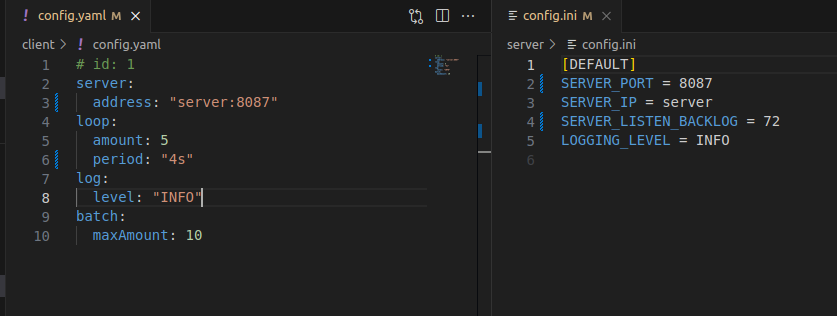
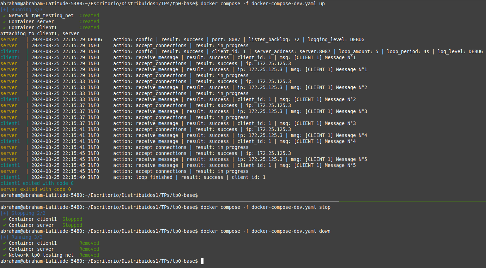
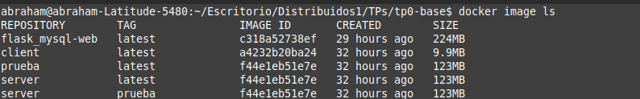

# TP0: Docker + Comunicaciones + Concurrencia
## Parte 1: Introducción a Docker

### Ejercicio N°2:
Modificar el cliente y el servidor para lograr que realizar cambios en el archivo de configuración no requiera un nuevo build de las imágenes de Docker para que los mismos sean efectivos. La configuración a través del archivo correspondiente (`config.ini` y `config.yaml`, dependiendo de la aplicación) debe ser inyectada en el container y persistida afuera de la imagen (hint: `docker volumes`).

### Solucion:
1. Comando para ejecutar los containers (luego de modificar los archivos config.ini y config.yaml) sin builder nuevamente la imagen:
```
    docker compose -f docker-compose-dev.yaml up
```
### Explicacion de la implementacion:
1. Para implementar los cambios dinamicos en los archivos de configuracion sin buildear las imagenes y sin modificar la imagen original, simplemente 
se agrego un campo volumes con el formato **./ruta_relativa_host**:**/ruta_absoluta_cliente** en los services server y client1 respectivamente.


### Ejemplo: 
1. Modificar los archivos config.ini y config.yaml (ej: cambiamos en ambos el puerto a 8087, en el server el listen_backlog a 72 y el period a 4s). 


2. Ejecutamos el comando ```docker compose -f docker-compose-dev.yaml up``` , no tiene sentido usar el **make docker-compose-up** porque tiene el 
    flag --build que obliga a rebuildear la imagen al ejecutar el comando.


3. Visualizamos los cambios que hicimos recientemente, luego hacemos un stop y un down en otra terminal. 


Las imagenes no han cambiado hace 32 horas, sin embargo estamos modficando los archivos de configuracion en el container, ahora si quisieramos una nueva imagen apartir de estos cambios tendriamos que hacer un commit.

