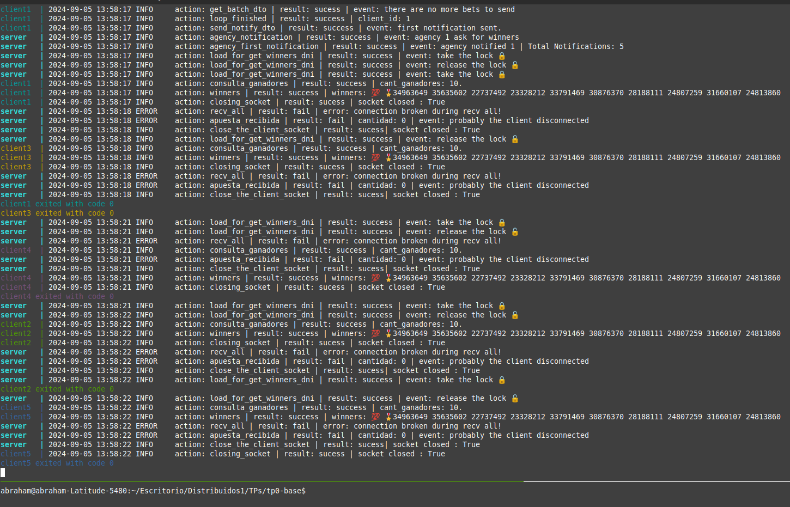
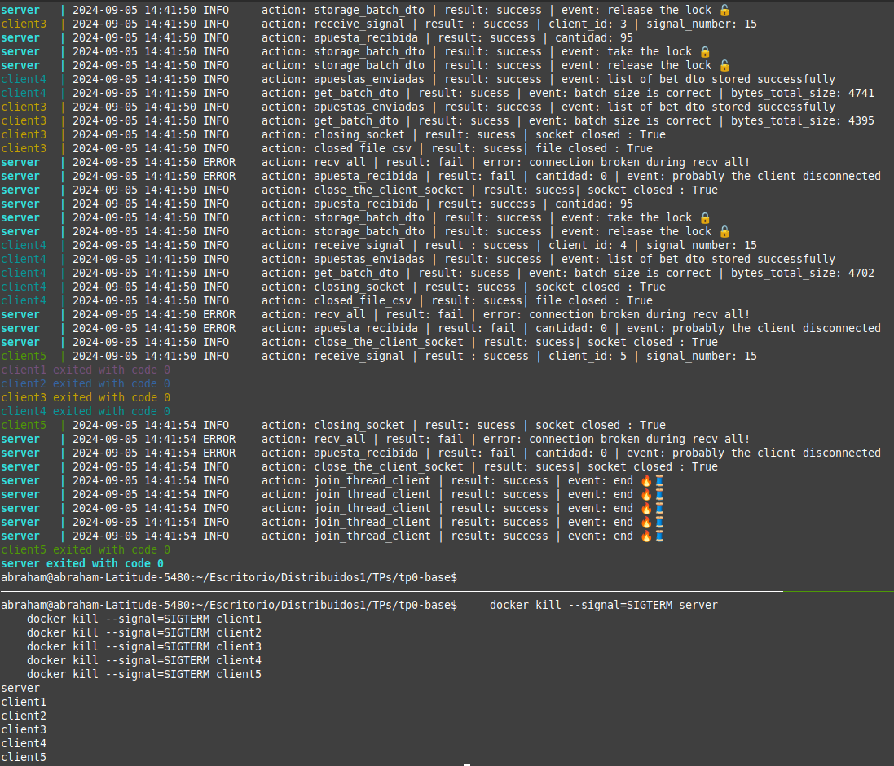

# TP0: Docker + Comunicaciones + Concurrencia
## Parte 3: Repaso de Concurrencia

### Ejercicio N°8:
Modificar el servidor para que permita aceptar conexiones y procesar mensajes en paralelo.
En este ejercicio es importante considerar los mecanismos de sincronización a utilizar para el correcto funcionamiento de la persistencia.

En caso de que el alumno implemente el servidor Python utilizando _multithreading_,  deberán tenerse en cuenta las [limitaciones propias del lenguaje](https://wiki.python.org/moin/GlobalInterpreterLock).

### Solucion : 
1. Para diseñar la solucion se hace uso de multithreading, como hay operaciones input/output (accept, recv, send del socket o el read/write de un file o un simple sleep) de espera, teniendo en cuenta el feature GIL no habria problema porque se ejecutan afuera del GIL (esto porque no hablamos con ningun objeto de python, asi que "libero al GIL" mientras esperamos).
2. Extra: En operaciones de CPU Intensivas, si tenemos multiples thread haciendo computo, solo uno de ellos va a poder usar el interpreter de python a la vez.

1. Se modelo la clase ClientThread que representa la conexion del cliente en el servidor tiene en su estado:
    1. El socket_peer respectivo (lo q nos retorna el accept)
    2. ProtectedStorage: para poder leer o cargar bets usando metodos thread-safe. 
    3. ProtectedNotificationCounter: Para contar las veces que se recibe un NotificationDTO de tipo FIRST_NOTIFICATION de manera thread/safe o obtener su valor del contador.
2. Por cada cliente que se conecte en el servidor vamos a crear un ClientThread para que se ejecute de forma paralela.
3. El ClientThread tiene su instancia de Protocol e interactua con el cliente recibiendo los BatchDTO y retornando Acks, etc.  
3. Del lado cliente (client.py) ahora solo se conecta una vez y ya no se "desconecta para dejar que otro se conecte" porque ahora la aplicacion es multithreading, puede ser atendido el cliente sin cortes.  (Si recibe una SIGTERM, se sigue desconectando y liberando recursos)

### Mecanismos de sincronizacion utilizado: 
1. Se implemento 2 monitores: 
1. ProtectedStorage: Usando el lock (herramienta de sincronizacion) se protege los metodos **store_batch_dto** (este metodo encapsula el metodo **store_bets**) 
y **get_winners_dni** (encapsula el metodo **load_bets**) para que los multiples thread accedan de a 1 al recurso compartido de manera segura sin race condition (bug de concurrencia).
1. ProtectedNotificationCounter: Tambien se usa el Lock, basicamente es un contador protegido de las veces que se recibio un NotificationDTO de tipo FIRST_NOTIFICATION
(porque un cliente termino de enviar todos los BatchDTO o termino su la cantidad de loops).


### Ejemplo: 
1. Para ejecutar el programa usamos: 
```
    make docker-compose-up
    make docker-compose-logs
``` 
Con un amount= 500 y un maxAmount 95 se obtuvo los sgts ganadores:



2. Garantizando la liberacion de recursos podemos ejecutar en medio de la ejecucion: 

```
    docker kill --signal=SIGTERM server
    docker kill --signal=SIGTERM client1
    docker kill --signal=SIGTERM client2
    docker kill --signal=SIGTERM client3
    docker kill --signal=SIGTERM client4
    docker kill --signal=SIGTERM client5
``` 
1. Observamos que al mandar las signals los client cierran su archivo csv y su socket de manera correcta.
2. En el lado del server al cerrar el socketAceptador vamos a cerrar los sockets peer de cada client thread y luego joineamos el thread que lanzamos en cada
instancia de ClientThread. Liberamos todos los recursos de manera exitosa.


