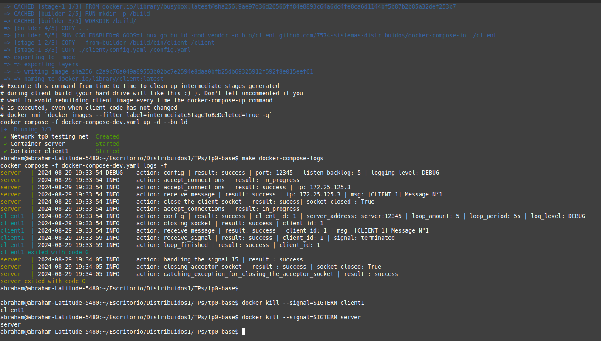
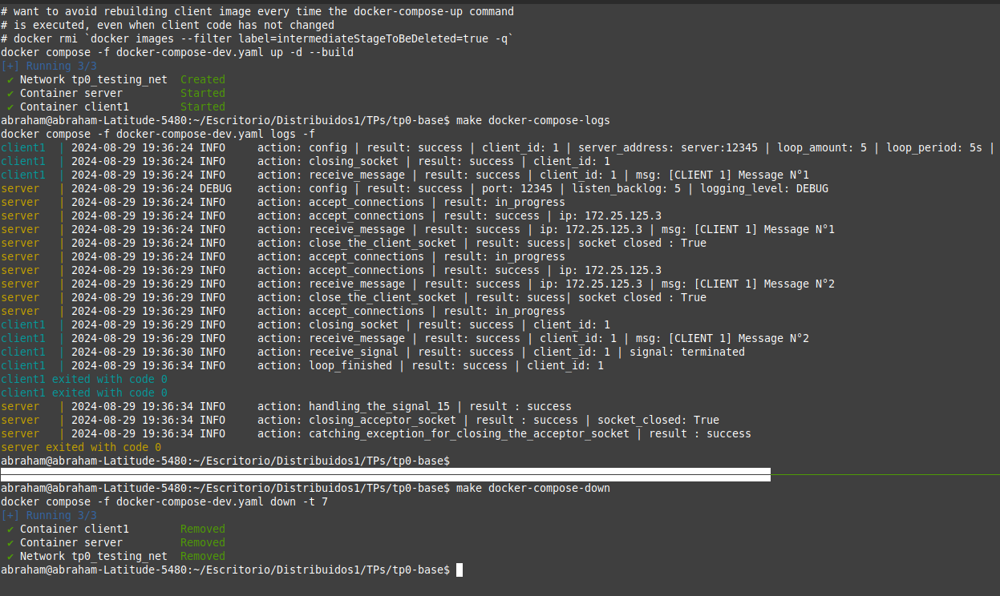
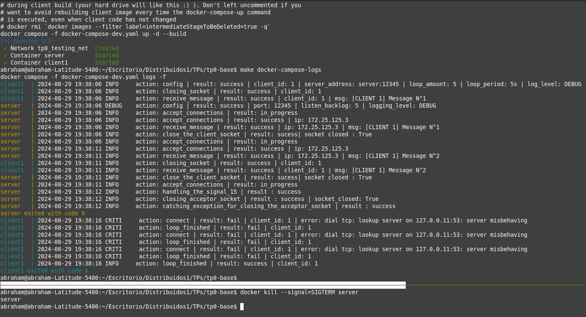

# TP0: Docker + Comunicaciones + Concurrencia

### Ejercicio N°4:
Modificar servidor y cliente para que ambos sistemas terminen de forma _graceful_ al recibir la signal SIGTERM. Terminar la aplicación de forma _graceful_ implica que todos los _file descriptors_ (entre los que se encuentran archivos, sockets, threads y procesos) deben cerrarse correctamente antes que el thread de la aplicación principal muera. Loguear mensajes en el cierre de cada recurso (hint: Verificar que hace el flag `-t` utilizado en el comando `docker compose down`).

### Solucion: 
Para ejecutar el ejercicio abrir una terminal y ejecutar: 
```
    make docker-compose-up
    make docker-compose-logs
```     
En otra terminal ejecutar:
``` 
    docker kill --signal=SIGTERM client1
    docker kill --signal=SIGTERM server
```
De esta manera enviaremos la signal SIGTERM tanto al client con id 1, como al server y en la primera terminal veremos los cambios ocurridos.

### Explicacion de la implementacion: 
Para resolver el ejercicio :
1. Server: se uso la librera **signal** de python y al recibir la signal SIGTERM se hace un context switch al handler del signal y ahi se setea en true el booleano **was_killed** en true y se cierra el socket aceptador(listener), se vuelve al context anterior, si esta bloqueado en el accept o cuando vuelva al accept provocara una excepcion (por que no se puede hacer accept con el socket cerrado), lo handelamos y retornamos None y asi continuamos hasta terminal normalmente el programa.

2. Client: Se uso la libreria basicas de **os/signal, signal, syscall** de go. Luego se crea un canal que almacena signals como SIGTERM y se lanza una gorrutina (un thread mas ligero) para no quedarse bloqueado en la operacion de <- (equivalente a un pop/recv), el manejo es setear en true el booleano, cuando es seteado en true se espera a que termine "la iteracion del loop en curso" (cerrando bien el socket y se verifica su cierre) y se cortara antes de que empieze el siguiente loop para terminar el programa de forma controlada. Para esto se aumento el tiempo que se usa en el flag -t (tiempo de espera para detener los containers) de 1 a 7.


### Ejemplo: 
1. Ejecutando los comandos anterior vemos que tanto el client como el servidor:


2. Si hacemos un **make docker-compose-up** y luego un **make docker-compose-logs** y luego un **make docker-compose-down***  obtenemos tambien que libera los recursos:



3. Si mandamos la signal primero al server, el cliente y el server liberan los recursos de forma correcta: 



