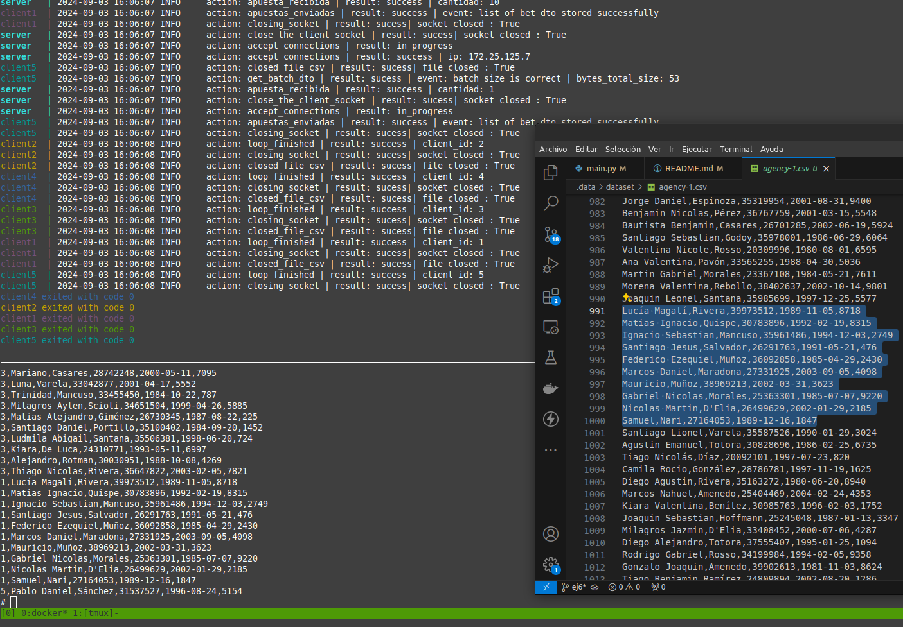
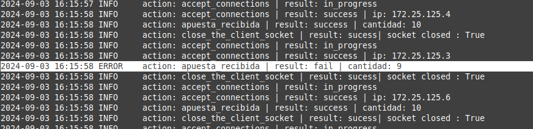
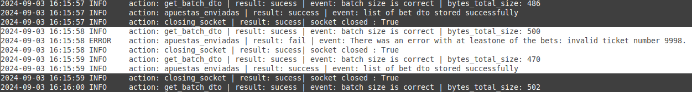
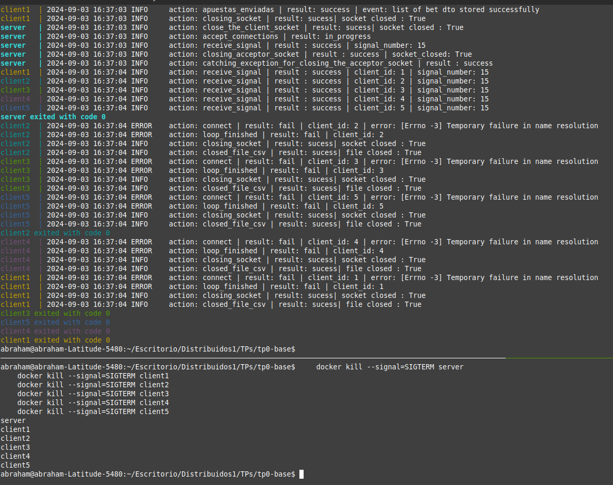

# TP0: Docker + Comunicaciones + Concurrencia
## Parte 2: Repaso de Comunicaciones

### Ejercicio N°7:
Modificar los clientes para que notifiquen al servidor al finalizar con el envío de todas las apuestas y así proceder con el sorteo.
Inmediatamente después de la notificacion, los clientes consultarán la lista de ganadores del sorteo correspondientes a su agencia.
Una vez el cliente obtenga los resultados, deberá imprimir por log: `action: consulta_ganadores | result: success | cant_ganadores: ${CANT}`.

El servidor deberá esperar la notificación de las 5 agencias para considerar que se realizó el sorteo e imprimir por log: `action: sorteo | result: success`.
Luego de este evento, podrá verificar cada apuesta con las funciones `load_bets(...)` y `has_won(...)` y retornar los DNI de los ganadores de la agencia en cuestión. Antes del sorteo, no podrá responder consultas por la lista de ganadores.
Las funciones `load_bets(...)` y `has_won(...)` son provistas por la cátedra y no podrán ser modificadas por el alumno.


### Solucion : 
1. 
2. 
3. 
4. 

### Protocolo: 
Protocolo mas basico explicado desde cero en el EJ5.


### Ejemplo: 
1. Para ejecutar el programa usamos: 
```
    make docker-compose-up
    make docker-compose-logs
``` 

1. Podemos ver el archivo que escribe el server usando otra terminal y escribiendo los comandos uno por uno: 
```
    docker exec -it server sh
    ls
    cat bets.csv
```
Con un amount = 10 y loop = 100 entonces podemos obtener los 1000 primeras apuestas y guardarlas en el bets.csv del server.

Observamos como que el bets.csv del server tiene las ultimas 10 apuestas de las 1000 primeras de la agency-1.csv idem con las demas
agency, (considerando que no hubo apuestas con errores)

Tambien se obtienen las apuestas con errores y se printean los logs correspondientes:
En el server:
```
    docker logs server
```


En el cliente (caso de la agencia3 que tenia un number = 998):
``` 
    docker logs client3
```


Garantizando la liberacion de recursos podemos ejecutar en medio de la ejecucion: 

```
    docker kill --signal=SIGTERM server
    docker kill --signal=SIGTERM client1
    docker kill --signal=SIGTERM client2
    docker kill --signal=SIGTERM client3
    docker kill --signal=SIGTERM client4
    docker kill --signal=SIGTERM client5
``` 
Observamos que se cierran el socket del cliente y el csv, del lado del server se cierra el socket aceptador(listener).

