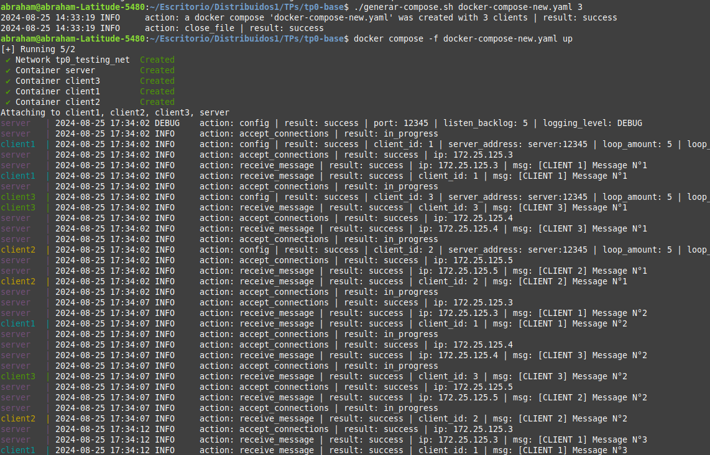

# TP0: Docker + Comunicaciones + Concurrencia

## Parte 1: Introducción a Docker

### Ejercicio N°1:
Definir un script de bash `generar-compose.sh` que permita crear una definición de DockerCompose con una cantidad configurable de clientes.  El nombre de los containers deberá seguir el formato propuesto: client1, client2, client3, etc. 

El script deberá ubicarse en la raíz del proyecto y recibirá por parámetro el nombre del archivo de salida y la cantidad de clientes esperados:

`./generar-compose.sh docker-compose-dev.yaml 5`

Considerar que en el contenido del script pueden invocar un subscript de Go o Python:

```
#!/bin/bash
echo "Nombre del archivo de salida: $1"
echo "Cantidad de clientes: $2"
python3 mi-generador.py $1 $2
```
### Solucion: 
Para ejecutar el script y generar el docker-compose con la cantida de clientes pedida se sigue el ejemplo de la consigna  por ej: 
```
    chmod +x ./generar-compose.sh 
    ./generar-compose.sh docker-compose-new.yaml 3
```
1. Esto creara un **docker-compose-new.yaml** con 3 clientes.
1. En caso de ingresar una cantidad de clientes negativa su valor pasara a ser 1. 
1. Ademas se informa la creacion del archivo y el cierre del mismo (si se pudo) por log. 

### Explicacion de la implementacion: 
1. Se creo un script que recibe los 2 primeros argumentos recibidos por consola y ejecuta un programa en python para delegar la logica. 
2. En el archivo **generate_docker_compose.py** se tienen varias funciones que nos ayuda a genear el docker-compose con la cantidad 
de clientes elegida, cada funcion cumple el ppio solid (Single Responsability) haciendo, escalable y mas facil de modificar algo en un futuro.
3. Se liberan todos los recursos usados (fd del archivo) y se hace uso de CTEs.


### Ejemplo : 
1. Primero se deben crear las imagenes para eso usamos el make.
2. Ejecutamos el script **generar-compose.sh** con sus argumentos. 
3. Ejecutamos el Docker compose (con el flag -f) usando el archivo yaml obtenido del script.
4. Cuando los clientes terminen usar control + C para hacer un "stop" a lo containers y luego un "down" para remover los containers y la red.

Comandos: 
``` 
    make docker-image
    ./generar-compose.sh docker-compose-new.yaml 3
    docker compose -f docker-compose-new.yaml up
    docker compose -f docker-compose-new.yaml down
``` 




