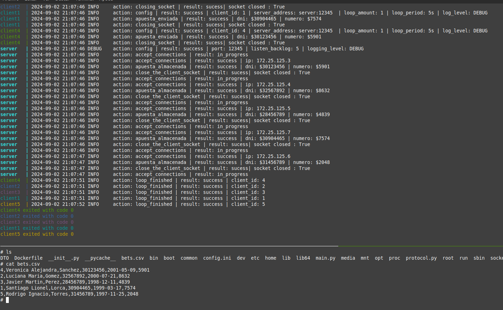

# TP0: Docker + Comunicaciones + Concurrencia
## Parte 2: Repaso de Comunicaciones

### Ejercicio N°6:
Modificar los clientes para que envíen varias apuestas a la vez (modalidad conocida como procesamiento por chunks o batchs). La información de cada agencia será simulada por la ingesta de su archivo numerado correspondiente, provisto por la cátedra dentro de .data/datasets.zip. Los batchs permiten que el cliente registre varias apuestas en una misma consulta, acortando tiempos de transmisión y procesamiento.

En el servidor, si todas las apuestas del batch fueron procesadas correctamente, imprimir por log: action: apuesta_recibida | result: success | cantidad: ${CANTIDAD_DE_APUESTAS}. En caso de detectar un error con alguna de las apuestas, debe responder con un código de error a elección e imprimir: action: apuesta_recibida | result: fail | cantidad: ${CANTIDAD_DE_APUESTAS}.

La cantidad máxima de apuestas dentro de cada batch debe ser configurable desde config.yaml. Respetar la clave batch: maxAmount, pero modificar el valor por defecto de modo tal que los paquetes no excedan los 8kB.

El servidor, por otro lado, deberá responder con éxito solamente si todas las apuestas del batch fueron procesadas correctamente.

### Solucion : 
1. Como cada cliente (Agencia quinela) envia una unica apuesta (no tiene sentido q se envie 5 veces el mismo numero) cambie el loop amount a 1. 
1. Para la implementacion del protocolo se uso el patron DTO creando los DTO: ackDTO y betDTO.
1. Ademas se creo la clase socketTCP que encapsula el comporaiento para evitar los short read/write y ademas recibe solo bytes y retorna bytes, es el protocolo quien se encarga de pasar los numeros (u8) (u16) (strings) a bytes para luego enviarlo por el objeto socket.
1. Se crearon las clases ServerProtocol y ClientProtocol ambos heredan de Protocol, esto para hacer escalable cuando hayan mas tipos de mensaje, 
ademas reduce la probabilidad de problemas en los protocolo debido a la simetria de los send y recv de los DTOs, hace muy dificil equivocarse, un ejemplo:
1. Si el ClientProtocol tiene un metodo que es send_bet_dto(a_bet_dto) entonces el server tendra su metodo **simetrico** recv_bet_dto().
1. 👉 Cuando se envia un string se envia en primer lugar 2 bytes (u16) con el tamaño del string en bytes y luego se envia el string (en bytes-codificado a utf8), el que recibe es lo mismo recibe primero los 2 bytes (u16) y con eso ya sabe cuantos bytes esperar para obtener el string.


### Protocolo: 
En primer lugar el cliente envia un **betDTO** compuesto por: 
1. operation_type (u8): 1 byte | sirve para identificar el tipo de operacion cada dto tiene uno. 
2. agency_id (u8): 1 byte | id de la agencia.
3. name (string): 2 bytes (u16:tamanio del string codificado) + bytes del strings |
4. last_name (string): 2 bytes + bytes del string
5. dni (string):  2 bytes + bytes del string.
6. birthday (string): 2 bytes + bytes del string.
7. number: (u16) 2 bytes : numero de la apuesta.   

El server recibe el betDTO y envia un **AckDTO**:
1. operation_type (u8): 1 byte 
2. response (u8): 1 byte | indica 0 si recibio ok el mensaje 
3. current_status (string): 2 bytes + bytes del string: | se usa para mandar algun mensaje mas descriptivo de la situacion.

El cliente recibe el ackDTO y termina. Ese es todo el protocolo por ahora en el ejercicio 5. 
El servidor recibe correctamente las apuestas y las escribe en el csv. 

### Ejemplo: 
1. Para ejecutar el programa usamos: 
```
    make docker-compose-up
    make docker-compose-logs
``` 

1. Podemos ver el archivo que escribe el server usando otra terminal y escribiendo los comandos uno por uno: 
```
    docker exec -it server sh
    ls
    cat bets.csv
```


