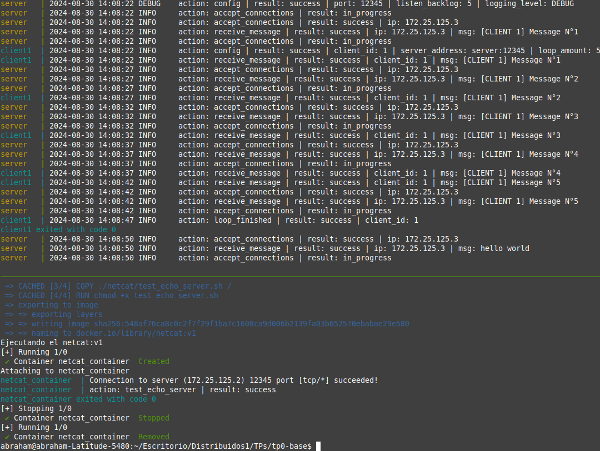

# TP0: Docker + Comunicaciones + Concurrencia
## Parte 1: Introducción a Docker
### Ejercicio N°3:
Crear un script de bash `validar-echo-server.sh` que permita verificar el correcto funcionamiento del servidor utilizando el comando `netcat` para interactuar con el mismo. Dado que el servidor es un EchoServer, se debe enviar un mensaje al servidor y esperar recibir el mismo mensaje enviado.

En caso de que la validación sea exitosa imprimir: `action: test_echo_server | result: success`, de lo contrario imprimir:`action: test_echo_server | result: fail`.

El script deberá ubicarse en la raíz del proyecto. Netcat no debe ser instalado en la máquina _host_ y no se puede exponer puertos del servidor para realizar la comunicación (hint: `docker network`). `

### Solucion: 
Para ejecutar el script usamos los sgts comandos: 
```
    make docker-compose-up
    chmod +x validar-echo-server.sh
    make docker-compose-logs
    ./validar-echo-server.sh  (en otra terminal)
```

### Explicacion de la implementacion: 
1. Para poder validar el echo-server usando netcat se creo un Dockerfile que instala una distribucion del linux (alpine, especializada para docker), y luego se le copia el script **validar-echo-server.sh**, le damos permisos y se ejecuta.
2. Luego de armar el Dockerfile hacemos el docker-compose **docker-compose-netcat.yaml** se asigna un nombre al container y se conecta a la misma red que esta el container server y el cliente (**tp0_testing_net**).
3. Observacion: Al hacer **make docker-compose-down** la red se elimina y al hacer **make docker-compose-up**  se crear una red con una id distinta a la anterior.


### Ejemplo: 
Para verificar el comportamiento correcto del echo server: 
1. Levantamos el server usando: ```make docker-compose-up```  
2. Abrimos el log para visualizar el output: ``` make docker-compose-logs ``` 
3. Ejecutamos el script anteriormente mencionado ```./validar-echo-server.sh```   
4. Se creara un container con el netcat instalado, se conectara al servidor y enviara el ensaje **hello world**.
5. El server nos retorna el "hello world" y al compararlo con lo enviado y se printeara por log un **sucess**.
6. Finalmente hacemos el down del make **make docker-compose-down** los stop y el down del container con netcat ya estan encapsulados en el script **validar-echo-server.sh**. 

Se observa el envio del **hello world** y la verificacion del mismo exitosamente.


