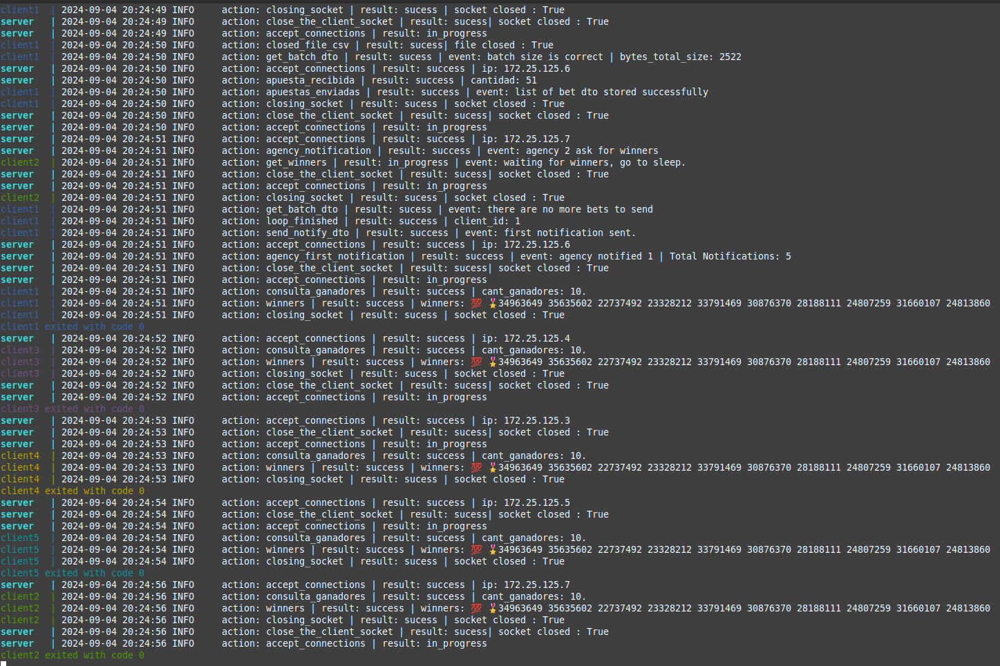

# TP0: Docker + Comunicaciones + Concurrencia
## Parte 2: Repaso de Comunicaciones

### Ejercicio N°7:
Modificar los clientes para que notifiquen al servidor al finalizar con el envío de todas las apuestas y así proceder con el sorteo.
Inmediatamente después de la notificacion, los clientes consultarán la lista de ganadores del sorteo correspondientes a su agencia.
Una vez el cliente obtenga los resultados, deberá imprimir por log: `action: consulta_ganadores | result: success | cant_ganadores: ${CANT}`.

El servidor deberá esperar la notificación de las 5 agencias para considerar que se realizó el sorteo e imprimir por log: `action: sorteo | result: success`.
Luego de este evento, podrá verificar cada apuesta con las funciones `load_bets(...)` y `has_won(...)` y retornar los DNI de los ganadores de la agencia en cuestión. Antes del sorteo, no podrá responder consultas por la lista de ganadores.
Las funciones `load_bets(...)` y `has_won(...)` son provistas por la cátedra y no podrán ser modificadas por el alumno.


### Solucion : 
### Protocolo: 
Protocolos mas basico Leer el README del EJ5 y el EJ6.
En esta etapa del protocolo: 

El cliente al terminar de loopear (la cantidad de veces: **amount** definido en el config.yaml) enviara un NotifyDTO compuesto por: 
1. operation_type(u8): (Su valor es 4) 1 byte
2. agency_id(u8): 1 byte
3. type_notification(u8): 1 byte | Aca tenemos dos valores posibles 0 (FIRST_NOTIFICATION) o 1 (TELL_ME_WINNERS).

El cliente: 
1. El cliente envia por una unica vez un NotifyDTO con type_notification en 0 (FIRST_NOTIFICATION) y luego inmediatamente despues envia un NotifiyDTO con type_notification en 1 (TELL_ME_WINNERS) (este enviara muchas veces hasta que el server le envie un **WinnersDTO**).
2. Cuando el cliente envia un NotifyDTO con el type_notification en 1 (TELL_ME_WINNERS) este puede recibir dos posibles ACK:
3. ACK cuyo current es 3 (ACK_CALCULATING_WINNERS) el cliente cierra la conexion, dormira unos 5s y luego volvera a conectarse.
4. ACK cuyo current es 4 (ACK_DEFINED_WINNERS), si recibe este tipo de ACK entonces el cliente tambien recibira el WinnersDTO (explicado lo que contiene en el server) donde tendra una lista con el DNI de los ganadores podra revisarlo y contar su cantidad.

El servidor: 
1. Cuando recibe el NotifyDTO con el campo type_notification en 0 (FIRST_NOTIFICATION) aumenta en 1 la cantidad de notificaciones, inmediatamente despues el server
recibe el NotifyDTO con el campo type_notification en 1 (TELL_ME_WINNERS) revisa la cantidad de notificaciones que tiene, si tiene 5 notificaciones responde con un WinnersDTO compuesto por: 
    1. operation_type(u8): (Su valor es 5) 1 byte 
    2. winners List(Str): lista de strings con el dni de los ganadores, para enviarlo se usan 2 bytes para enviar el largo del array y luego se envia cada string (Ver readme Ej5).
2. Si el server no tiene aun las 5 notificaciones respondera un ACK cuyo current es 3 (ACK_CALCULATING_WINNERS) y cerra la conexion para atender a otro cliente.


### Ejemplo: 
1. Para ejecutar el programa usamos: 
```
    make docker-compose-up
    make docker-compose-logs
``` 
Resultados usando loop-amoun: 500 y un batch de maxAmount: 95 : 



2. Garantizando la liberacion de recursos podemos ejecutar en medio de la ejecucion: 

```
    docker kill --signal=SIGTERM server
    docker kill --signal=SIGTERM client1
    docker kill --signal=SIGTERM client2
    docker kill --signal=SIGTERM client3
    docker kill --signal=SIGTERM client4
    docker kill --signal=SIGTERM client5
``` 
Observamos que se cierran el socket del cliente y el archivo csv, del lado del server se cierra el socket aceptador(listener).

